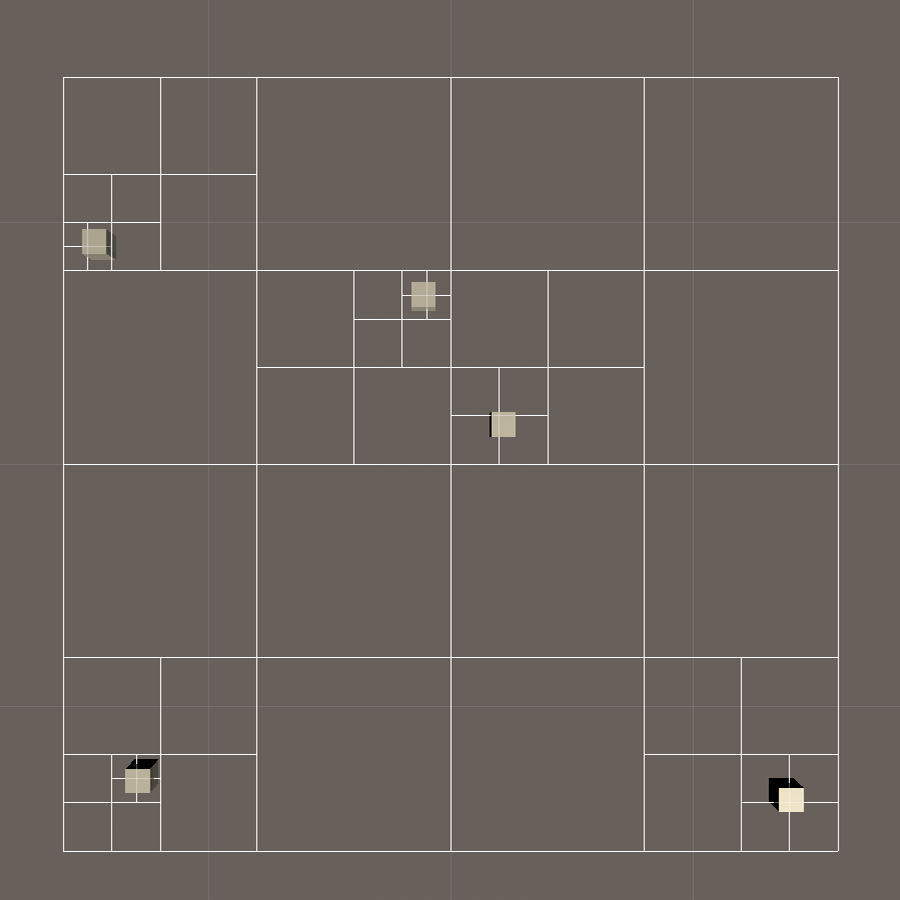

# Quadtree for Unity
> v1.0

This package provides a generic implementation of the quadtree spatial partitioning algorithm.
The aim of this package is to provide an out of the box working solution for simple 2D spatial partitioning of Unity’s GameObjects but at the same time allowing the implementation to be easily extended, modified and used with any items that you would want it to.
The tree can be used as a component of a GameObject or it can just as easily be used only in the scripts without it being attached to any GameObject.

## Installation
Please refer to the [releases page](https://github.com/dolejska-daniel/unity-quadtree/releases).

## Usage examples
Please refer to the [PDF documentation](Documentation/Documentation.pdf).
